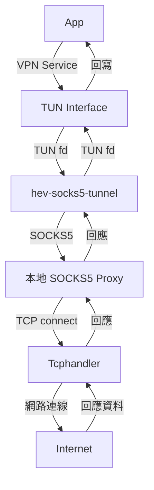

# HEV Socks5 Tunnel 替換 Tun2Socks 架構規劃

> 本文件內容來源：架構規劃討論  
> 僅供參考，請依實際需求調整。

---

## 1. 替換步驟與設計重點

### 目標
將現有 [`VpnPacketProcessor`](app/src/main/java/com/example/vpntest/core/VpnPacketProcessor.kt:1)，修改或替換為 [hev-socks5-tunnel](https://github.com/heiher/hev-socks5-tunnel) 方案。

### 步驟
1. **分析現有資料流**  
   - 釐清 VPN Service 目前如何將 TUN 封包導向 TCP/UDP 處理與 SOCKS5 Proxy。
2. **移除 Tun2Socks/TcpHandler/Socks5Proxy**  
   - 移除自有的 TUN 封包解析、TCP/UDP 處理與 SOCKS5 Proxy 相關程式碼。
3. **整合 hev-socks5-tunnel**  
   - 以子程序方式啟動 `hev-socks5-tunnel`，將 TUN 介面直接交由其接管。
   - 於 Android 端以 JNI 或 Process 管理方式啟動與監控。
4. **參數與路由設計**  
   - 根據需求設定 socks5 server 參數、路由規則、DNS 轉發等。
5. **錯誤處理與監控**  
   - 加入子程序存活監控、異常重啟、日誌收集等機制。

---

## 2. UDP（DNS）支援與建議

- **直接使用 hev-socks5-tunnel 之 UDP redirect 功能**：
  `hev-socks5-tunnel` 內建「Redirect UDP packets」（Fullcone NAT, UDP in UDP/TCP）功能，建議直接啟用此特性，讓 UDP（含 DNS）流量可經由 tunnel 轉發，無需額外 workaround。
---

## 3. 替換後資料流與簡易架構圖

### 資料流說明

1. VPN Service 建立 TUN 介面
2. TUN 介面交由 `hev-socks5-tunnel` 處理
3. `hev-socks5-tunnel` 解析封包並轉發至本地端 SOCKS5 Proxy
4. SOCKS5 Proxy 經 Tcphandler 連接至網路
5. 回應資料經由 `hev-socks5-tunnel` 回寫至 TUN 介面，最終回到 App

### 架構圖

---

## 4. 相容性與測試重點

- **Android 版本相容性**：確認 TUN fd 傳遞與子程序啟動於各版本可用性。
- **權限管理**：需確保 VPN、網路、子程序權限正確。
- **資源釋放**：VPN 停止時須正確關閉 `hev-socks5-tunnel`。
- **UDP/DNS 行為**：測試 DNS 查詢、UDP 封包處理是否正常。
- **異常處理**：模擬 hev-socks5-tunnel 異常終止、重啟流程。
- **效能測試**：評估延遲、吞吐量、資源消耗。

---

## 5. 備註

- 本文件內容來源為架構規劃討論，僅供參考。
- 實際實作細節請依專案需求與平台限制調整。