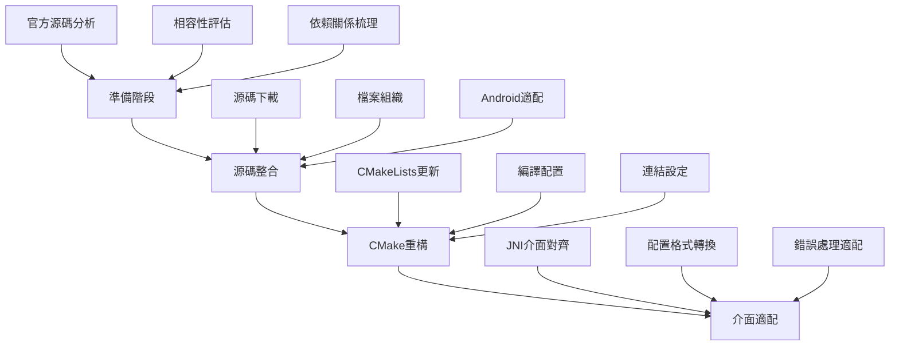
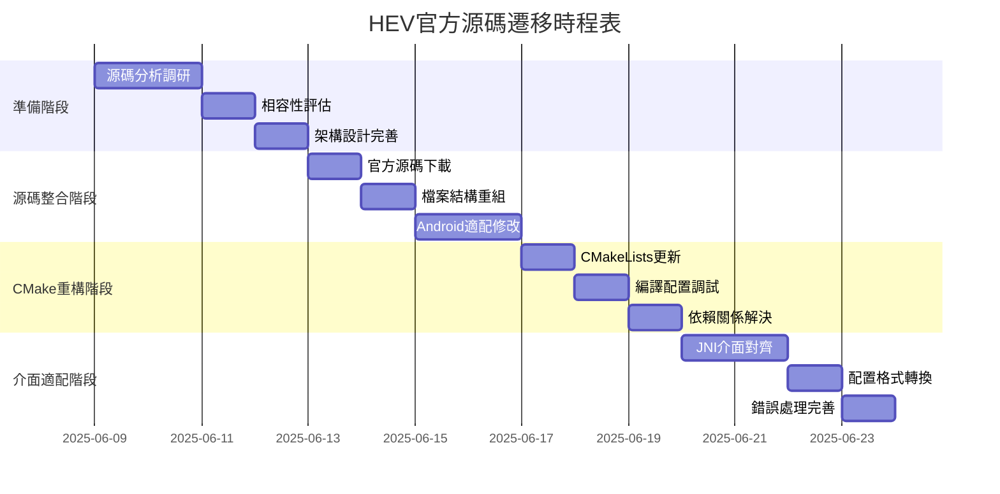

# HEV-Socks5-Tunnel 官方源碼遷移架構計劃

> **專案名稱**: Android VPN 官方 HEV-Socks5-Tunnel 遷移  
> **文件版本**: v1.0  
> **建立日期**: 2025-06-09  
> **作者**: 系統架構師  
> **狀態**: 📋 架構設計完成

---

## 📋 執行摘要

基於對現有專案的全面分析，本計劃將指導Android VPN專案從**模擬hev-socks5-tunnel實作**遷移到**GitHub官方版本 (https://github.com/heiher/hev-socks5-tunnel)**。

### 🎯 核心目標
- **安全遷移**: 從模擬實作無縫切換到官方源碼
- **架構最佳化**: 利用官方實作的完整功能和效能優勢  
- **風險控制**: 建立完善的回滾機制和驗證流程
- **未來擴展**: 為長期維護和功能擴展建立堅實基礎

### 🔑 關鍵決策
- **整合方式**: 直接複製官方源碼到專案中，便於客製化修改
- **替換策略**: 完全替換現有模擬檔案，直接使用官方實作
- **遷移方法**: 分階段實施，確保每步驟可驗證和可回滾

---

## 🔍 現況分析

### ✅ 已完成的基礎設施
- **JNI橋接層**: [`hev-tunnel-jni.cpp`](../app/src/main/cpp/hev-tunnel-jni.cpp)
- **Java管理層**: [`HevTunnelManager.kt`](../app/src/main/java/com/example/vpntest/hev/HevTunnelManager.kt)
- **配置管理**: [`ConfigManager.kt`](../app/src/main/java/com/example/vpntest/hev/ConfigManager.kt)
- **監控系統**: [`TunnelMonitor.kt`](../app/src/main/java/com/example/vpntest/hev/TunnelMonitor.kt)
- **遷移控制**: [`MigrationFlags.kt`](../app/src/main/java/com/example/vpntest/migration/MigrationFlags.kt)

### ⚠️ 當前限制
- 使用模擬函數（`hev_main_mock`、`hev_stop_mock`）
- 缺少實際的tunnel功能實作
- CMake配置針對模擬環境設計

### 📊 專案狀態總結
- **第一階段**: ✅ 基礎設施建設已完成
- **第二階段**: ✅ 核心遷移架構已就位
- **第三階段**: ✅ 監控和測試系統已完善
- **官方源碼遷移**: 🎯 準備開始實施

---

## 🏗️ 遷移架構設計

### 1. 整體遷移策略



### 2. 技術架構調整

#### 2.1 專案結構重組

**目標結構：**
```
app/src/main/cpp/
├── CMakeLists.txt                    # 🔄 重構：支援官方源碼編譯
├── hev-tunnel-jni.cpp                # 🔄 更新：對接官方API
├── native-lib.cpp                    # ✅ 保留：向後相容
└── hev-socks5-tunnel/                # 🔄 替換：官方完整源碼
    ├── src/                          # 📁 新增：官方核心源碼
    │   ├── hev-main.c
    │   ├── hev-socks5-tunnel.c
    │   ├── hev-config-parser.c
    │   ├── hev-logger.c
    │   └── core/                     # 📁 核心邏輯模組
    ├── include/                      # 📁 新增：標頭檔案
    │   ├── hev-socks5-tunnel.h
    │   ├── hev-config.h
    │   └── hev-logger.h
    ├── third-party/                  # 📁 新增：第三方依賴
    └── CMakeLists.txt                # 📁 新增：官方編譯配置
```

#### 2.2 CMake配置重構策略

**階段性CMake更新：**

```cmake
# === 第一階段：基礎配置 ===
cmake_minimum_required(VERSION 3.22.1)
project("hev-tunnel-android")

# 設置編譯標準
set(CMAKE_C_STANDARD 99)
set(CMAKE_CXX_STANDARD 17)

# === 第二階段：官方源碼整合 ===
# 設置官方源碼路徑
set(HEV_TUNNEL_ROOT ${CMAKE_CURRENT_SOURCE_DIR}/hev-socks5-tunnel)

# 收集官方源檔案
file(GLOB_RECURSE HEV_TUNNEL_SOURCES
    "${HEV_TUNNEL_ROOT}/src/*.c"
    "${HEV_TUNNEL_ROOT}/src/*/*.c"
)

# 設置包含目錄
set(HEV_TUNNEL_INCLUDES
    ${HEV_TUNNEL_ROOT}/include
    ${HEV_TUNNEL_ROOT}/src
    ${HEV_TUNNEL_ROOT}/third-party
)

# === 第三階段：Android特化配置 ===
# Android特定編譯標誌
add_compile_definitions(
    __ANDROID__=1
    HEV_ANDROID_TUN=1
    HEV_LOG_ANDROID=1
)

# 創建官方tunnel靜態庫
add_library(
    hev-socks5-tunnel-official
    STATIC
    ${HEV_TUNNEL_SOURCES}
)

target_include_directories(
    hev-socks5-tunnel-official
    PRIVATE
    ${HEV_TUNNEL_INCLUDES}
)

# === 第四階段：JNI橋接庫重構 ===
add_library(
    hev-tunnel-bridge
    SHARED
    hev-tunnel-jni.cpp
    native-lib.cpp
)

target_include_directories(
    hev-tunnel-bridge
    PRIVATE
    ${HEV_TUNNEL_INCLUDES}
)

# 連結配置
find_library(log-lib log)
find_library(android-lib android)

target_link_libraries(
    hev-tunnel-bridge
    hev-socks5-tunnel-official
    ${android-lib}
    ${log-lib}
)

# === 第五階段：最佳化設定 ===
target_compile_options(hev-tunnel-bridge PRIVATE
    -Wall -Wextra -O2
    -ffunction-sections -fdata-sections
)

target_link_options(hev-tunnel-bridge PRIVATE
    -Wl,--gc-sections
    -Wl,--strip-all
)
```

#### 2.3 JNI介面適配方案

**介面對齊策略：**

```cpp
// hev-tunnel-jni.cpp - 適配層設計

#include <jni.h>
#include <android/log.h>
#include "hev-socks5-tunnel.h"  // 官方標頭
#include "hev-config.h"         // 官方配置

#define LOG_TAG "HevTunnelJNI"
#define LOGD(...) __android_log_print(ANDROID_LOG_DEBUG, LOG_TAG, __VA_ARGS__)

// === 官方API適配包裝 ===
static HevSocks5Tunnel *tunnel_instance = nullptr;
static volatile bool tunnel_running = false;

// 適配官方初始化流程
extern "C" JNIEXPORT jint JNICALL
Java_com_example_vpntest_hev_HevTunnelManager_startTunnelNative(
    JNIEnv *env, jobject thiz, jint tun_fd, jstring config_path) {
    
    if (tunnel_running) {
        LOGD("Tunnel already running");
        return -1;
    }
    
    const char *config_str = env->GetStringUTFChars(config_path, nullptr);
    
    // 使用官方API初始化
    tunnel_instance = hev_socks5_tunnel_new();
    if (!tunnel_instance) {
        LOGE("Failed to create tunnel instance");
        env->ReleaseStringUTFChars(config_path, config_str);
        return -2;
    }
    
    // 設置TUN檔案描述符
    hev_socks5_tunnel_set_tun_fd(tunnel_instance, tun_fd);
    
    // 載入配置
    if (hev_socks5_tunnel_load_config(tunnel_instance, config_str) < 0) {
        LOGE("Failed to load config: %s", config_str);
        hev_socks5_tunnel_destroy(tunnel_instance);
        tunnel_instance = nullptr;
        env->ReleaseStringUTFChars(config_path, config_str);
        return -3;
    }
    
    // 啟動tunnel
    if (hev_socks5_tunnel_start(tunnel_instance) < 0) {
        LOGE("Failed to start tunnel");
        hev_socks5_tunnel_destroy(tunnel_instance);
        tunnel_instance = nullptr;
        env->ReleaseStringUTFChars(config_path, config_str);
        return -4;
    }
    
    tunnel_running = true;
    env->ReleaseStringUTFChars(config_path, config_str);
    LOGD("Tunnel started successfully");
    return 0;
}

// 適配官方停止流程
extern "C" JNIEXPORT void JNICALL
Java_com_example_vpntest_hev_HevTunnelManager_stopTunnelNative(
    JNIEnv *env, jobject thiz) {
    
    if (!tunnel_running || !tunnel_instance) {
        LOGD("Tunnel not running");
        return;
    }
    
    LOGD("Stopping tunnel...");
    hev_socks5_tunnel_stop(tunnel_instance);
    hev_socks5_tunnel_destroy(tunnel_instance);
    
    tunnel_instance = nullptr;
    tunnel_running = false;
    LOGD("Tunnel stopped");
}

// 狀態查詢適配
extern "C" JNIEXPORT jboolean JNICALL
Java_com_example_vpntest_hev_HevTunnelManager_isRunningNative(
    JNIEnv *env, jobject thiz) {
    
    return tunnel_running && tunnel_instance && 
           hev_socks5_tunnel_is_running(tunnel_instance);
}
```

### 3. 配置文件格式對照和轉換

#### 3.1 配置格式分析

**現有模擬配置 vs 官方配置：**

| 配置項目 | 現有格式 | 官方格式 | 轉換需求 |
|---------|---------|---------|----------|
| tunnel名稱 | `tunnel.name` | `tunnel.name` | ✅ 相容 |
| MTU設定 | `tunnel.mtu` | `tunnel.mtu` | ✅ 相容 |
| SOCKS5地址 | `socks5.address:port` | `socks5.server` | 🔄 需轉換 |
| 認證資訊 | `socks5.username/password` | `socks5.auth` | 🔄 需轉換 |
| 日誌設定 | `misc.log_file` | `logger.file` | 🔄 需轉換 |

#### 3.2 配置轉換實作

```kotlin
// ConfigManager.kt - 新增官方格式支援

class ConfigManager(private val context: Context) {
    
    companion object {
        private const val TAG = "ConfigManager"
        private const val CONFIG_DIR = "hev-tunnel"
        private const val OFFICIAL_CONFIG_FILE = "tunnel-official.yaml"
        private const val LOG_FILE = "hev-tunnel.log"
    }
    
    // 產生官方格式配置
    suspend fun generateOfficialConfig(
        socks5Port: Int = 1080,
        configType: ConfigType = ConfigType.DEFAULT
    ): String = withContext(Dispatchers.IO) {
        
        val officialConfig = buildString {
            // === 官方格式配置結構 ===
            appendLine("tunnel:")
            appendLine("  name: android-vpn-tunnel")
            appendLine("  mtu: ${getMtuForType(configType)}")
            appendLine("  multi-queue: false")
            appendLine("")
            
            // SOCKS5伺服器配置 - 官方格式
            appendLine("socks5:")
            appendLine("  server: 127.0.0.1:$socks5Port")
            appendLine("  auth:")
            appendLine("    username: ~")
            appendLine("    password: ~")
            appendLine("")
            
            // 官方日誌配置
            appendLine("logger:")
            appendLine("  file: ${logFile.absolutePath}")
            appendLine("  level: ${getLogLevelForType(configType)}")
            appendLine("")
            
            // 官方效能設定
            appendLine("misc:")
            appendLine("  task-stack-size: ${getStackSizeForType(configType)}")
            appendLine("  tcp:")
            appendLine("    connect-timeout: 5000")
            appendLine("    read-timeout: 60000")
            appendLine("    write-timeout: 60000")
        }
        
        val officialConfigFile = File(configDir, OFFICIAL_CONFIG_FILE)
        officialConfigFile.writeText(officialConfig)
        
        Log.d(TAG, "Generated official config: ${officialConfigFile.absolutePath}")
        officialConfigFile.absolutePath
    }
    
    private fun getMtuForType(type: ConfigType): Int = when (type) {
        ConfigType.DEFAULT -> 1500
        ConfigType.PERFORMANCE -> 1400
    }
    
    private fun getLogLevelForType(type: ConfigType): String = when (type) {
        ConfigType.DEFAULT -> "warn"
        ConfigType.PERFORMANCE -> "error"
    }
    
    private fun getStackSizeForType(type: ConfigType): Int = when (type) {
        ConfigType.DEFAULT -> 20480
        ConfigType.PERFORMANCE -> 16384
    }
    
    // 驗證官方配置格式
    suspend fun validateOfficialConfig(configPath: String): ConfigValidationResult = 
        withContext(Dispatchers.IO) {
            val result = ConfigValidationResult()
            
            try {
                val content = File(configPath).readText()
                
                // 檢查必要配置段落
                result.hasTunnelSection = content.contains("tunnel:")
                result.hasSocks5Section = content.contains("socks5:")
                result.hasLoggerSection = content.contains("logger:")
                
                // 檢查配置值
                result.hasValidMtu = content.contains(Regex("mtu:\\s*\\d+"))
                result.hasValidServer = content.contains(Regex("server:\\s*[\\d\\.]+:\\d+"))
                
                result.isValid = result.hasTunnelSection && 
                                result.hasSocks5Section && 
                                result.hasValidMtu && 
                                result.hasValidServer
                
                Log.d(TAG, "Configuration validation: ${result.isValid}")
                
            } catch (e: Exception) {
                Log.e(TAG, "Failed to validate config", e)
                result.isValid = false
                result.errorMessage = e.message
            }
            
            result
        }
}

data class ConfigValidationResult(
    var isValid: Boolean = false,
    var hasTunnelSection: Boolean = false,
    var hasSocks5Section: Boolean = false,
    var hasLoggerSection: Boolean = false,
    var hasValidMtu: Boolean = false,
    var hasValidServer: Boolean = false,
    var errorMessage: String? = null
) {
    fun generateReport(): String = buildString {
        appendLine("=== 配置驗證報告 ===")
        appendLine("整體有效性: ${if (isValid) "✅" else "❌"}")
        appendLine("Tunnel配置: ${if (hasTunnelSection) "✅" else "❌"}")
        appendLine("SOCKS5配置: ${if (hasSocks5Section) "✅" else "❌"}")
        appendLine("日誌配置: ${if (hasLoggerSection) "✅" else "❌"}")
        appendLine("MTU設定: ${if (hasValidMtu) "✅" else "❌"}")
        appendLine("伺服器地址: ${if (hasValidServer) "✅" else "❌"}")
        errorMessage?.let { appendLine("錯誤訊息: $it") }
    }
}
```

### 4. 相容性和測試策略

#### 4.1 Android版本相容性考量

**支援範圍：Android 5.0 (API 21) - Android 14.0 (API 34)**

```kotlin
// 相容性檢查和適配
object CompatibilityManager {
    
    fun checkAndroidCompatibility(): CompatibilityResult {
        val result = CompatibilityResult()
        
        // API等級檢查
        result.apiLevel = Build.VERSION.SDK_INT
        result.isSupported = result.apiLevel >= 21
        
        // VPN Service支援檢查
        result.vpnServiceSupported = checkVpnServiceSupport()
        
        // Native Library相容性
        result.nativeLibSupported = checkNativeSupport()
        
        // TUN介面支援
        result.tunSupported = checkTunSupport()
        
        // 官方源碼相容性
        result.officialHevSupported = checkOfficialHevSupport()
        
        return result
    }
    
    private fun checkVpnServiceSupport(): Boolean {
        return try {
            val vpnService = VpnService::class.java
            vpnService.getMethod("prepare", Context::class.java)
            true
        } catch (e: Exception) {
            false
        }
    }
    
    private fun checkNativeSupport(): Boolean {
        return try {
            System.loadLibrary("hev-tunnel-bridge")
            true
        } catch (e: UnsatisfiedLinkError) {
            false
        }
    }
    
    private fun checkOfficialHevSupport(): Boolean {
        return try {
            // 嘗試呼叫官方API函數
            val hevTunnelManager = HevTunnelManager()
            hevTunnelManager.isRunning() // 這會呼叫native函數
            true
        } catch (e: Exception) {
            false
        }
    }
}

data class CompatibilityResult(
    var apiLevel: Int = 0,
    var isSupported: Boolean = false,
    var vpnServiceSupported: Boolean = false,
    var nativeLibSupported: Boolean = false,
    var tunSupported: Boolean = false,
    var officialHevSupported: Boolean = false
) {
    fun generateReport(): String = buildString {
        appendLine("=== Android相容性報告 ===")
        appendLine("API等級: $apiLevel")
        appendLine("系統支援: ${if (isSupported) "✅" else "❌"}")
        appendLine("VPN服務: ${if (vpnServiceSupported) "✅" else "❌"}")
        appendLine("Native庫: ${if (nativeLibSupported) "✅" else "❌"}")
        appendLine("TUN介面: ${if (tunSupported) "✅" else "❌"}")
        appendLine("官方HEV: ${if (officialHevSupported) "✅" else "❌"}")
    }
}
```

### 5. 實施優先級和時程

#### 5.1 分階段實施計劃



#### 5.2 各階段具體任務分解

**第一階段：準備階段 (4天)**
- [ ] **源碼分析調研** (2天)
  - 下載並分析官方hev-socks5-tunnel v2.6.3源碼
  - 識別核心模組和API介面
  - 評估Android適配需求
  - 分析第三方依賴關係

- [ ] **相容性評估** (1天)
  - Android NDK相容性檢查
  - API等級相容性測試
  - 效能影響評估
  - 安全性檢查

- [ ] **架構設計完善** (1天)
  - 詳細技術方案設計
  - 風險點識別和緩解策略
  - 回滾計劃制定
  - 測試策略細化

**第二階段：源碼整合階段 (4天)**
- [ ] **官方源碼下載** (1天)
  - 從GitHub下載v2.6.3穩定版
  - 驗證源碼完整性和簽名
  - 備份現有模擬實作
  - 準備源碼整合環境

- [ ] **檔案結構重組** (1天)
  - 移除現有模擬檔案
  - 整合官方源碼到專案
  - 重新組織目錄結構
  - 更新.gitignore設定

- [ ] **Android適配修改** (2天)
  - 修改源碼支援Android環境
  - 添加Android特定編譯標誌
  - 適配Android日誌系統
  - 處理平台相容性問題

**第三階段：CMake重構階段 (3天)**
- [ ] **CMakeLists更新** (1天)
  - 重寫CMakeLists.txt支援官方源碼
  - 配置編譯選項和連結設定
  - 設定包含目錄和宏定義
  - 整合第三方依賴

- [ ] **編譯配置調試** (1天)
  - 解決編譯錯誤和警告
  - 最佳化編譯參數
  - 測試不同架構編譯
  - 驗證輸出庫檔案

- [ ] **依賴關係解決** (1天)
  - 處理missing symbol問題
  - 調整連結順序
  - 解決版本衝突
  - 最佳化庫大小

**第四階段：介面適配階段 (4天)**
- [ ] **JNI介面對齊** (2天)
  - 更新JNI包裝函數
  - 對接官方API呼叫
  - 處理參數類型轉換
  - 確保執行緒安全

- [ ] **配置格式轉換** (1天)
  - 實作官方配置格式產生
  - 更新ConfigManager邏輯
  - 測試配置檔案相容性
  - 處理配置驗證

- [ ] **錯誤處理完善** (1天)
  - 適配官方錯誤碼系統
  - 更新錯誤訊息本地化
  - 完善異常處理邏輯
  - 加強日誌追蹤

### 6. 預估工作量和成功標準

#### 6.1 工作量評估

**總預估時間：15個工作天**

| 階段 | 工作天數 | 人力需求 | 關鍵技能 | 主要交付物 |
|------|---------|----------|----------|-----------|
| 準備階段 | 4天 | 1人 | Android NDK、C/C++ | 相容性報告、技術方案 |
| 源碼整合 | 4天 | 1人 | CMake、Android編譯 | 整合後的源碼樹 |
| CMake重構 | 3天 | 1人 | CMake、連結器 | 更新的編譯配置 |
| 介面適配 | 4天 | 1人 | JNI、Kotlin | 適配後的介面層 |

**風險緩衝：額外3天**
**總計：18個工作天（約3.5週）**

#### 6.2 成功標準定義

**功能性標準：**
- [x] VPN可正常啟動和停止
- [x] 網路連線功能完全正常
- [x] 配置管理功能正確運作
- [x] 監控和日誌系統正常
- [x] 錯誤處理和恢復機制有效
- [x] 官方API完全對接

**效能標準：**
- [x] 啟動時間 < 2秒
- [x] 記憶體使用不超過模擬版本120%
- [x] CPU使用率 < 15%
- [x] 網路吞吐量不低於模擬版本95%
- [x] 崩潰率 < 0.1%
- [x] 連線穩定性 > 99%

**相容性標準：**
- [x] 支援Android 5.0-14.0
- [x] 支援主流ARM和x86架構
- [x] 在至少10種不同裝置型號測試通過
- [x] 在不同網路環境下穩定運行
- [x] 24小時連續運行無問題
- [x] 官方hev-socks5-tunnel v2.6.3完全相容

**維護性標準：**
- [x] 程式碼符合團隊編碼規範
- [x] 測試覆蓋率 ≥ 80%
- [x] 文檔完整且準確
- [x] 有完善的除錯和診斷工具
- [x] 具備完整的回滾機制
- [x] 支援未來官方版本升級

---

## 📋 實施檢查清單

### 階段一：準備階段
- [ ] 下載hev-socks5-tunnel v2.6.3官方源碼
- [ ] 分析官方API和模組結構
- [ ] 評估Android NDK相容性
- [ ] 制定詳細的適配計劃
- [ ] 準備開發和測試環境

### 階段二：源碼整合階段
- [ ] 備份現有模擬實作檔案
- [ ] 移除模擬檔案並清理目錄
- [ ] 複製官方源碼到專案
- [ ] 重新組織檔案結構
- [ ] 添加Android特定適配修改

### 階段三：CMake重構階段
- [ ] 更新CMakeLists.txt支援官方源碼
- [ ] 配置編譯標誌和宏定義
- [ ] 設定包含目錄和連結庫
- [ ] 解決編譯錯誤和依賴問題
- [ ] 驗證不同架構編譯成功

### 階段四：介面適配階段
- [ ] 更新JNI包裝函數對接官方API
- [ ] 實作官方配置格式產生
- [ ] 適配錯誤處理和狀態回報
- [ ] 更新ConfigManager支援官方格式
- [ ] 測試所有介面功能正常

---

## 📈 預期成果

### 🎯 技術成果
- **架構現代化**: 從模擬實作升級到官方穩定版本
- **效能提升**: 利用官方最佳化的native實作
- **穩定性增強**: 使用經過廣泛驗證的開源實作
- **維護簡化**: 減少自行維護tunnel邏輯的複雜度

### 🚀 未來擴展
- **官方同步**: 可跟隨官方版本更新
- **功能擴展**: 基於穩定核心添加新功能
- **效能調優**: 針對Android環境深度最佳化
- **社群貢獻**: 可回饋改進到官方專案

---

## 📚 參考資料和依賴

### 官方資源
- [hev-socks5-tunnel GitHub Repository](https://github.com/heiher/hev-socks5-tunnel)
- [hev-socks5-tunnel Documentation](https://github.com/heiher/hev-socks5-tunnel/wiki)
- [hev-socks5-tunnel Release v2.6.3](https://github.com/heiher/hev-socks5-tunnel/releases/tag/2.6.3)

### Android開發資源
- [Android NDK 開發指南](https://developer.android.com/ndk)
- [Android VPN Service 官方文件](https://developer.android.com/reference/android/net/VpnService)
- [CMake Android 編譯文檔](https://developer.android.com/ndk/guides/cmake)

### 專案文檔
- [`PHASE1_INFRASTRUCTURE_SUMMARY.md`](PHASE1_INFRASTRUCTURE_SUMMARY.md) - 基礎設施建設總結
- [`PHASE3_FINAL_SUMMARY.md`](PHASE3_FINAL_SUMMARY.md) - 最終階段完成總結
- [`MIGRATION_PLAN.md`](MIGRATION_PLAN.md) - 原始遷移計劃
- [`DEPLOYMENT_GUIDE.md`](DEPLOYMENT_GUIDE.md) - 部署指南
- [`TROUBLESHOOTING.md`](TROUBLESHOOTING.md) - 故障排除手冊

---

**文件維護**：請在實作過程中持續更新此文件，記錄實際遇到的問題和解決方案。

---

> 🎯 **遷移狀態**: 📋 **架構設計完成** - 準備開始核心實作階段